<!-- GENERATED FILE. Do not edit directly. Run npm run docs:diagrams. -->

---
status: generated
owner: platform
doc_type: diagram
fidelity: generated
title: "Factory Service Map"
generator: npm run docs:diagrams
last_generated: 2026-06-28
source:
  - docs/service-registry.yml
---

# Factory Service Map

**Source hash:** `sha256:b67ef32a478891427a85b0003dd60385d8b1b6f366838e59ac8e4b87a97bd92e`

```mermaid
flowchart LR
  registry["docs/service-registry.yml"]
  workers["Workers"]
  pages["Pages"]
  registry --> workers
  registry --> pages
  workers --> worker_prime_self["prime-self\nhttps://api.selfprime.net"]
  workers --> worker_schedule_worker["schedule-worker\nhttps://schedule.latwoodtech.work"]
  workers --> worker_video_cron["video-cron\nhttps://video-cron.latwoodtech.work"]
  workers --> worker_inbound_oracle["inbound-oracle\nhttps://inbound-oracle.latwoodtech.work"]
  workers --> worker_synthetic_monitor["synthetic-monitor\nhttps://monitor.latwoodtech.work"]
  workers --> worker_status_prober["status-prober\nhttps://status.latwoodtech.work"]
  workers --> worker_admin_studio_staging["admin-studio-staging\nhttps://api.admin.latimerwoods.dev"]
  workers --> worker_admin_studio_production["admin-studio-production\nhttps://api.apunlimited.com"]
  workers --> worker_capricast_api_staging["capricast-api-staging\nhttps://api.capricast.latimerwoods.dev"]
  workers --> worker_capricast_api["capricast-api\nhttps://api.capricast.com"]
  workers --> worker_cypher_healing["cypher-healing\nhttps://api.cipherofhealing.com"]
  workers --> worker_coh["coh\nhttps://api.cypherofhealing.com"]
  workers --> worker_factory_cross_repo["factory-cross-repo\nhttps://factory-cross-repo.latwoodtech.work"]
  workers --> worker_factory_agent_gateway["factory-agent-gateway\nhttps://factory-agent-gateway.adrper79.workers.dev"]
  workers --> worker_factory_supervisor["factory-supervisor\nhttps://supervisor.latwoodtech.work"]
  workers --> worker_lead_gen["lead-gen\nhttps://lead-gen.adrper79.workers.dev"]
  workers --> worker_factory_core_api["factory-core-api\nhttps://core.latwoodtech.work"]
  workers --> worker_factory_network["factory-network\nhttps://network.latwoodtech.work"]
  workers --> worker_factory_events_replay["factory-events-replay\nurl unknown"]
  workers --> worker_webhook_fanout["webhook-fanout\nhttps://webhooks.latwoodtech.work/stripe"]
  workers --> worker_daily_brief["daily-brief\nhttps://dbrief.latwoodtech.work"]
  workers --> worker_linkedin_publisher["linkedin-publisher\nhttps://linkedin-publisher.adrper79.workers.dev"]
  workers --> worker_xico_city["xico-city\nhttps://xicocity.com"]
  workers --> worker_xico_city_staging["xico-city-staging\nhttps://staging.xicocity.com"]
  workers --> worker_qa_tools_worker["qa-tools-worker\nhttps://api.qa.latimerwoods.dev"]
  workers --> worker_marketing_supervisor["marketing-supervisor\nhttps://marketing.latwoodtech.work"]
  workers --> worker_marketing_supervisor_staging["marketing-supervisor-staging\nhttps://marketing-supervisor-staging.adrper79.workers.dev"]
  workers --> worker_mysticapi["mysticapi\nhttps://api.mysticapi.com"]
  workers --> worker_watch_selfprime["watch-selfprime\nhttps://watch.selfprime.net"]
  workers --> worker_referrals["referrals\nhttps://referrals.latwoodtech.work"]
  workers --> worker_llm_rank_worker["llm-rank-worker\nhttps://llm-rank.latwoodtech.work"]
  workers --> worker_analytics_proxy["analytics-proxy\nhttps://analytics.latwoodtech.work"]
  pages --> page_prime_self_ui["prime-self-ui\nurl unknown"]
  pages --> page_admin_studio_ui["admin-studio-ui\nurl unknown"]
  pages --> page_admin_studio_ui_storybook["admin-studio-ui-storybook\nurl unknown"]
  pages --> page_capricast_web["capricast-web\nurl unknown"]
  pages --> page_coh_web["coh-web\nurl unknown"]
  pages --> page_qa_tools_ui["qa-tools-ui\nurl unknown"]
  pages --> page_latimerwoods_dev["latimerwoods-dev\nurl unknown"]
```

